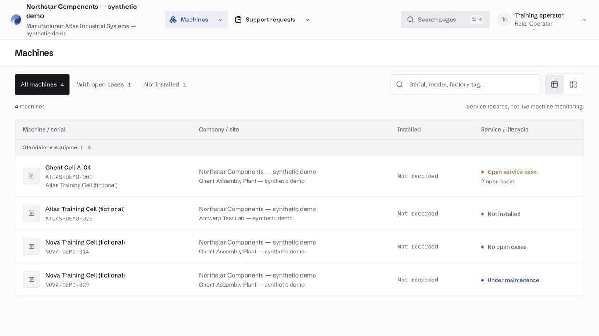
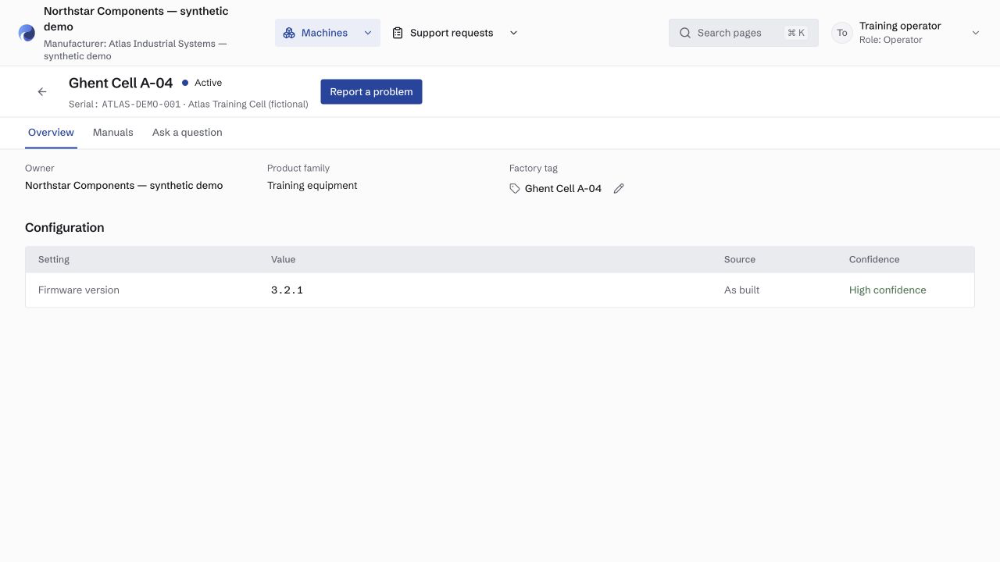
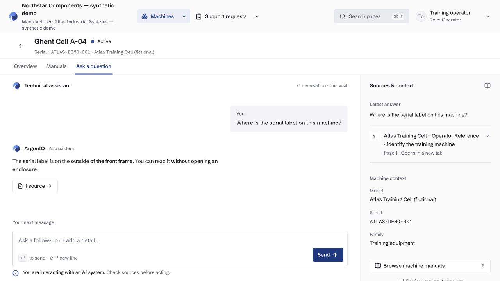
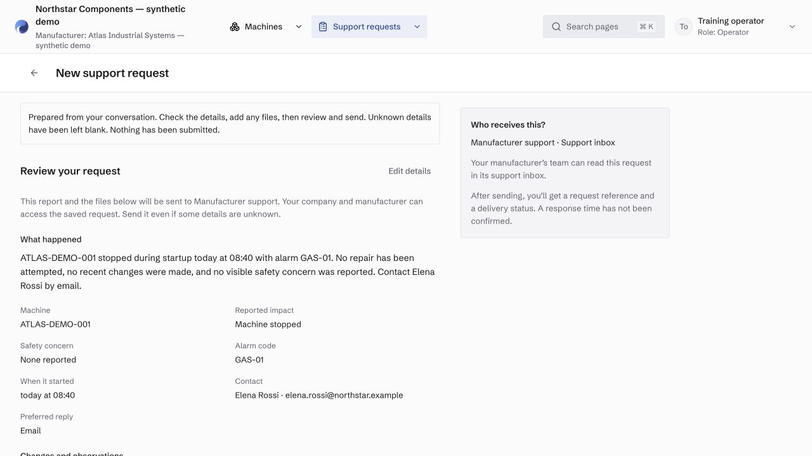

# ArgonIQ

ArgonIQ is a development prototype for customer support around industrial machinery.

This repository is a sanitized public snapshot for code review. It does not
include the private development history or any real customer data.

It brings machine records, technical manuals, customer questions, and support
requests into one workspace. A user selects a machine, opens the documents
available for that machine, asks a technical question, and can prepare a support
request for the manufacturer.

All examples in this repository use fictional companies, machines, people, and
documents. They are software fixtures, not operating instructions.

> **Status:** ArgonIQ is not ready for production use. Invitation-based
> onboarding, complete document publication and revision controls, verification
> of generated claims, production file storage, and the full case lifecycle are
> still incomplete.

## What currently works

- Separate signed-in views for manufacturer, customer, and platform users
- Companies, sites, contacts, machine models, production lines, and installed machines
- Machine-specific configuration and document access
- PDF upload, text extraction, indexing, and source viewing
- Technical questions using the selected machine and permitted document context
- Source references displayed beside generated answers
- Editable support requests with attachments and explicit confirmation before sending
- A manufacturer case queue, with optional email and Salesforce delivery adapters
- Server-side permission checks and PostgreSQL row-level security policies
- Unit and integration tests, plus automated checks for unsafe guidance,
  restricted-data leakage, and tenant isolation

## What is not complete

- Customer invitations and membership administration
- Reliable document approval, publication, and revision replacement
- Claim-by-claim verification of generated answers
- Production object storage and deployment checks
- Case assignment, replies, resolution, and closure
- Learning from reviewed service history
- Validated customer outcomes

Passing tests demonstrate the scenarios they cover. They do not establish
production security, universal model accuracy, or safe field performance.

## Screenshots

These browser captures use fictional sample data. Names, serial numbers,
companies, contact details, and technical documents shown here are invented for
the demo.

### Installed base



### Machine record



### Answer with a source reference



### Support request review



The capture checklist is in
[`docs/screenshots/README.md`](docs/screenshots/README.md).

## Architecture

```text
Next.js portal
    │
    ├── tRPC and guarded HTTP routes
    │       │
    │       └── application services and permission checks
    │               ├── PostgreSQL + row-level security
    │               ├── document retrieval and answer pipeline
    │               └── support-request delivery adapters
    │
    └── background worker
            ├── PDF extraction and chunking
            ├── embedding jobs
            └── support-delivery retries
```

The repository is a TypeScript monorepo using Next.js, React, tRPC, Zod,
Drizzle, PostgreSQL with pgvector, Better Auth, pg-boss, the Vercel AI SDK,
Vitest, and Playwright. Business rules and authorization live in application
services rather than page components.

## Run locally

### Requirements

- Node.js 22
- pnpm 12
- PostgreSQL 17 with pgvector
- Python 3 with ReportLab, used only to generate fictional sample PDFs

On macOS, the database helper expects Homebrew's PostgreSQL 17 path by default.
On Linux or another installation, set `PG_BIN` to the directory containing
`initdb`, `pg_ctl`, and `psql`.

```bash
corepack enable
corepack prepare pnpm@12.3.4 --activate
pnpm install --frozen-lockfile
python3 -m pip install -r tools/dev/requirements.txt
cp .env.example .env
make setup
make dev
```

Open `http://127.0.0.1:3100/login` and sign in with one of the documented
fictional accounts:

| Workspace                   | Email                       | Password                      |
| --------------------------- | --------------------------- | ----------------------------- |
| Manufacturer administration | `admin@training.invalid`    | `Training-only-password-2026` |
| Machine customer            | `operator@training.invalid` | `Training-only-password-2026` |

`make setup` creates an isolated local database under `.dev/`, applies the
migrations, generates fictional PDFs, and inserts the sample accounts. It does
not connect to a remote database. `make dev` starts the portal and document
worker; `make stop` stops the local database.

The checked-in default is `AI_MODE=fake`, which exercises the interface without
paid model calls. To test a live provider, explicitly configure an AI provider
and model in `.env`. Do not use real customer documents in the demo environment.

## Checks

```bash
pnpm typecheck
pnpm lint
pnpm test
pnpm test:eval
pnpm build
```

The eval suite is a finite set of synthetic scenarios for unsafe advice,
restricted-content leakage, and cross-tenant output. A passing run is useful
regression evidence, not a general safety guarantee.

## License

ArgonIQ is open source under the [MIT License](LICENSE). The repository is a
development snapshot; no customer deployment or hosted service is offered
through it.
